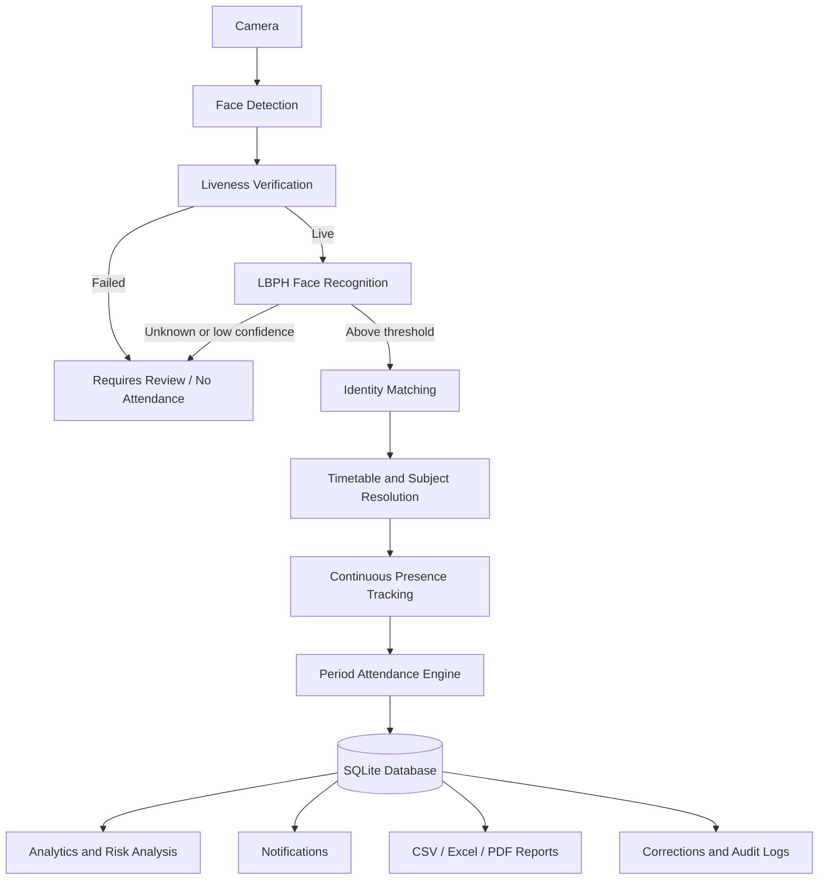

<p align="center">
  
</p>

<h1 align="center">SmartAttend AI</h1>

<p align="center"><strong>Intelligent Face Recognition, Period Attendance Analytics & Early-Warning System</strong></p>

<p align="center">
  
  
  
  
  
</p>

SmartAttend AI is a local-first college attendance application built with Streamlit, OpenCV, and SQLite. It combines webcam face enrollment and LBPH recognition with challenge-response liveness, timetable-aware class resolution, continuous presence tracking, period-wise attendance decisions, analytics, reports, alerts, correction workflows, and audit records.

> **Privacy notice:** biometric samples, trained models, student contact lists, attendance databases, generated reports, logs, and credentials are intentionally excluded from this repository. A clone starts with an empty local database.

## ✦ Contents

- [Problem statement](#-problem-statement)
- [Objectives](#-objectives)
- [Core capabilities](#-core-capabilities)
- [System architecture](#-system-architecture)
- [Attendance decision model](#-attendance-decision-model)
- [Technology stack](#-technology-stack)
- [Project structure](#-project-structure)
- [Installation](#-installation)
- [Running the application](#-running-the-application)
- [Initial setup and roles](#-initial-setup-and-roles)
- [Operational workflows](#-operational-workflows)
- [SMTP email setup](#-smtp-email-setup)
- [Testing](#-testing)
- [Security and privacy](#-security-and-privacy)
- [Troubleshooting](#-troubleshooting)
- [Current limitations](#-current-limitations)
- [Future scope](#-future-scope)

## ◈ Problem statement

Manual roll calls consume teaching time, create transcription errors, and make it difficult to reason about attendance across individual class periods. A single recognition event is also weak evidence that a student remained in class. SmartAttend AI addresses these issues by attaching verified observations to a scheduled period and evaluating every eligible student against that period.

## ◎ Objectives

- Identify enrolled students from a Windows webcam without requiring a cloud service.
- Require liveness and recognition confidence before accepting an observation.
- Resolve the current subject, faculty, department, section, semester, and period from a configurable timetable.
- Track first seen, last seen, and approximate presence for each student.
- Finalize every scheduled class with `PRESENT`, `LATE`, `INCOMPLETE`, `ABSENT`, or `EXCUSED` states.
- Calculate reports and risk features from eligible periods rather than raw recognition-event counts.
- Give authorized staff controlled correction, administration, and audit tools.
- Preserve compatibility with existing department/section CSV storage and LBPH models.

## ✦ Core capabilities

### 🎥 Camera and recognition

- Browser-owned WebRTC camera streaming for HTTPS deployments, with explicit browser permission controls.
- Automatic probing of camera indexes `0–5` with Windows-compatible OpenCV backends.
- Camera test, selection, safe acquisition, release, stale-lock recovery, and Streamlit rerun protection.
- Haar-cascade face detection and LBPH recognition using `opencv-contrib-python`.
- Multi-face bounding boxes with name, roll number, confidence, and verification status.
- Training from captured student samples while retaining compatibility with existing LBPH data.
- Low-confidence and unrecognized faces are never mapped to a student.
- A frame containing no face does not produce an `Unknown` attendance event.

### ◉ Liveness and continuous presence

- Per-face challenge-response liveness based on an open/closed/open eye transition and natural motion checks.
- Clear `LIVE`, `VERIFYING`, `SPOOF DETECTED`, and `UNKNOWN` states.
- Attendance observations require both liveness success and recognition above the configured threshold.
- Repeated observations update `first_seen`, `last_seen`, and accumulated presence.
- One database row per student and class session prevents duplicate attendance.

### 🗓 Period and timetable integration

- Configurable department, section, semester, course, faculty, weekday, start/end time, room, and period.
- Automatic current-class resolution with the legacy period schedule as fallback.
- A weekly timetable view highlights the currently active hour.
- Finalized periods supply the denominator for attendance percentages and risk analysis.
- Every eligible student receives a final state when a class is finalized, including students with no recognition event.

### 📊 Operations and analytics

- Period-wise overview, daily statistics, department/section filters, and status distributions.
- CSV, Excel, and PDF exports with class and presence metadata.
- Absence alerts and teacher summaries through Gmail SMTP.
- Risk analysis based on current percentage, recent absences, consecutive absences, late frequency, and recent trend.
- `Insufficient data for prediction` is shown when the historical sample is too small or lacks useful class variation.
- Faculty corrections require a reason and retain original/new status, reviewer, and timestamp.
- Admin/HOD audit-log filters cover attendance changes, enrollment, timetable operations, access events, and exports while redacting sensitive fields.

### 🎨 Interface

- Responsive warm academic theme using `#291C0E`, `#6E473B`, `#A78D78`, `#BEB5A9`, and `#E1D4C2`.
- Integrated SmartAttend AI mark, readable cards, compact forms, and accessible focus states.
- Navigation for Attendance, Training, Timetable, Risk Analysis, Corrections, Audit Logs, Email Alerts, and Staff Access.

## ⬡ System architecture



The Streamlit entry point coordinates views. Reusable services own camera access, liveness, timetable resolution, attendance rules, corrections, prediction, and auditing. SQLite stores normalized operational data. Existing CSV files can still be read and imported without deleting their originals.

## ◷ Attendance decision model

Attendance is evaluated per **student × eligible finalized period**.

| State | Meaning |
|---|---|
| `PRESENT` | Verified observations satisfy the configured presence requirement and the arrival is within the late threshold. |
| `LATE` | The student is verified after the configured late threshold and satisfies the required presence. |
| `INCOMPLETE` | The student was verified but accumulated presence is below the required duration. |
| `ABSENT` | The student was eligible for the finalized period but had no qualifying presence. |
| `EXCUSED` | An authorized exception entered through the correction workflow. |

The unique `(session_id, student_id)` database constraint prevents duplicates. Missing recognition events are converted to `ABSENT` only during period finalization; they are not inferred from isolated records.

## ⚙ Technology stack

| Layer | Technology |
|---|---|
| Interface | Streamlit 1.63, custom CSS |
| Camera and vision | OpenCV Contrib 4.11, Haar Cascade, LBPH |
| Data processing | pandas, NumPy |
| Storage | SQLite with parameterized queries |
| Reports | pandas/OpenPyXL, ReportLab |
| Email | Python `smtplib`, Gmail SMTP over SSL |
| Security | PBKDF2-HMAC-SHA256 password hashes, random salts, role checks, expiring sessions |
| Validation | Python `unittest`, Streamlit AppTest |

## ◫ Project structure

```text
SmartAttend_AI/
├── streamlit_app.py                 # Streamlit application entry point
├── face_pipeline.py                 # Shared face-detection helpers
├── train_faces.py                   # LBPH training utility
├── setup.bat                        # Windows virtual-environment setup
├── run_app.bat                      # Windows application launcher
├── requirements.txt
├── .env.example
├── .streamlit/
│   └── config.toml                  # Base Streamlit theme/server settings
├── assets/                          # SmartAttend AI brand assets
├── scripts/
│   └── import_aiml_sem5_timetable.py
├── smart_attendance/
│   ├── database/                    # SQLite connection, schema, migrations/imports
│   ├── services/                    # Business logic and authorization boundaries
│   ├── utils/                       # Passwords, sessions, validation, scopes
│   ├── views/                       # Timetable, risk, correction, audit and access UI
│   ├── theme.css
│   └── ui_theme.py
├── tests/                           # Critical non-camera tests and UI smoke tests
├── data/                            # Generated database; contents are ignored
├── dataset/                         # Generated face/CSV/model data; contents are ignored
├── exports/                         # Generated reports; contents are ignored
└── models/                          # Local optional models; contents are ignored
```

SQLite creates normalized tables for users, students, departments, sections, faculty, subjects, timetables, class sessions, attendance, face profiles, notifications, corrections, audit logs, settings, imports, and anomalies.

## ⬇ Installation

### Requirements

- Windows 10 or 11
- Python 3.12 (64-bit recommended)
- A webcam for capture and live attendance
- Git, when cloning the repository

### Automated Windows setup

```powershell
git clone https://github.com/chinmayee1096/SmartAttend_AI.git
cd SmartAttend_AI
.\setup.bat
```

`setup.bat` creates `.venv` and installs the pinned packages from `requirements.txt`.

### Manual setup

```powershell
py -3.12 -m venv .venv
.\.venv\Scripts\Activate.ps1
python -m pip install --upgrade pip
python -m pip install -r requirements.txt
```

If PowerShell blocks activation, the environment can still be used directly:

```powershell
.\.venv\Scripts\python.exe -m pip install -r requirements.txt
```

## ▶ Running the application

Double-click `run_app.bat`, or run:

```powershell
.\run_app.bat
```

For direct startup:

```powershell
.\.venv\Scripts\python.exe -m streamlit run streamlit_app.py --server.address 127.0.0.1 --server.port 8501
```

Open [http://localhost:8501](http://localhost:8501). The database and required runtime directories are created automatically.

An alternate database path can be set before launch:

```powershell
$env:SMARTATTEND_DB = "D:\AttendanceData\smartattend.sqlite3"
.\run_app.bat
```

## 🔐 Initial setup and roles

Open **Staff Access** on a fresh database and create the first administrator. No default username or password is shipped. Passwords must contain 12–256 characters and are stored as salted PBKDF2 hashes.

| Role | Authorized scope |
|---|---|
| `ADMIN` | System users, students, faculty, timetable, settings, all analytics, corrections, and audit logs. |
| `FACULTY` | Assigned classes, attendance review, reports, and corrections for assigned timetable entries. |
| `HOD` | Department-scoped timetable, analytics, risk results, and audit review. |
| `STUDENT` | Own student-scoped information where exposed by the service layer; no attendance editing. |

The service layer validates roles and scope in addition to controlling visible pages.

## ⇄ Operational workflows

### 1. Register and enroll a student

1. Open **Training**.
2. Select department and section, then enter the student roll number and name.
3. Choose the required camera and run the camera test.
4. Start capture in even lighting with one face centered in view.
5. Capture varied frontal samples with small natural head movements.
6. Train the selected department/section model.
7. Confirm that the training result maps the correct LBPH label to the correct student.

### 2. Configure the timetable

Use **Timetable** as an administrator to create departments, sections, courses, faculty assignments, weekdays, rooms, periods, and start/end times. The included AIML Semester 5 importer can seed the photographed institutional schedule:

```powershell
.\.venv\Scripts\python.exe scripts\import_aiml_sem5_timetable.py
```

Review imported rows in the UI before live use. The current hour is highlighted. When no active timetable entry matches, the legacy period schedule remains available as a fallback.

### 3. Run live attendance

1. Open **Attendance** and select the department and section.
2. Confirm the resolved course, faculty, period, and time.
3. Start capture and complete the on-screen liveness action.
4. Keep the session running so periodic observations can accumulate presence.
5. Stop and finalize the scheduled class when the period ends.
6. Review the period summary; students with no qualifying observation are included as absent.

### 4. Review risk

Risk Analysis uses period outcomes, not the number of stored events. It displays current period attendance, recent direction, absence/late patterns, risk level, probability when a valid model can be fitted, and a readable reason. Sparse or one-class data produces `Insufficient data for prediction`.

### 5. Correct attendance

An administrator or assigned faculty member can select a record, choose a new status, and enter a mandatory reason. The operation stores the original status, new status, actor, reason, and time and writes a redacted audit entry. Student accounts cannot perform corrections.

### 6. Generate reports

Attendance reports support department, section, date, and period-aware summaries. CSV, Excel, and PDF outputs include course, faculty, class time, first/last seen, approximate presence, and final status where available. Generated files remain local under ignored runtime paths.

## ✉ SMTP email setup

SmartAttend AI sends absence alerts and teacher summaries through Gmail SMTP (`smtp.gmail.com`, SSL port `465`).

1. Sign in to the Google account that will send attendance mail.
2. Open **Google Account → Security** and enable **2-Step Verification**.
3. Open **App passwords**, create an app password for SmartAttend AI, and copy the generated 16-character value.
4. In SmartAttend AI, open **Email Alerts**.
5. Enter the sender Gmail address and the app password. Use the app password, not the normal Google password.
6. Add or verify student/parent and teacher email addresses.
7. Use preview mode first, then send a test summary before sending attendance alerts.

SMTP credentials are held only in the active Streamlit session by this build. They are not written to SQLite, CSV, source code, audit logs, `.env.example`, or generated reports. Restarting the app clears them.

## ✓ Testing

Run the complete test suite from the repository root:

```powershell
.\.venv\Scripts\python.exe -m unittest discover -s tests -v
```

The suite covers attendance decisions, duplicate prevention, automatic absence, liveness state transitions, timetable resolution, low-attendance feature generation, correction authorization, audit records, and Streamlit navigation/smoke behavior. Camera hardware remains an integration test because OpenCV backend behavior depends on the Windows device and driver.

Useful import and syntax checks:

```powershell
.\.venv\Scripts\python.exe -m compileall streamlit_app.py smart_attendance
.\.venv\Scripts\python.exe -c "import cv2, streamlit, pandas; print(cv2.__version__)"
```

## 🛡 Security and privacy

- Passwords use salted PBKDF2-HMAC-SHA256 with 600,000 rounds.
- Login attempts are rate-limited and application sessions expire.
- Service functions enforce ADMIN, FACULTY, HOD, and STUDENT scopes.
- SQLite operations use parameterized statements.
- Audit metadata removes password, secret, token, credential, SMTP, embedding, and image fields.
- SMTP passwords remain in memory for the current UI session.
- Face images, labels, trained model files, contact lists, databases, reports, and logs are excluded by `.gitignore`.
- Unknown or low-confidence faces cannot create student attendance.
- Biometric capture should be performed with informed institutional consent and a documented retention policy.

Before sharing a fork, check staged files:

```powershell
git status --short
git diff --cached --name-only
```

Never use `git add -f` for `data`, `dataset`, `models`, `exports`, `.env`, Streamlit secrets, logs, or local backups.

## 🧰 Troubleshooting

| Problem | Resolution |
|---|---|
| `python` is not recognized | Install Python 3.12 with the Python Launcher, then use `py -3.12` or the `.venv\Scripts\python.exe` path. |
| `cv2.face` is unavailable | Remove conflicting OpenCV packages and reinstall the pinned `opencv-contrib-python==4.11.0.86`. |
| Camera cannot open locally | Select **Local OpenCV camera**, stop other camera apps, try another index, and allow desktop camera access in Windows Privacy settings. |
| Deployed site cannot access camera | Select **Browser camera**, click Test camera or start capture, click the WebRTC **START** control, and choose **Allow** in the browser permission prompt. |
| DirectShow/MSMF warnings | Stop capture, wait for resource release, retry another camera index/backend, and update the webcam driver. The camera service falls back across supported backends. |
| Camera remains locked after a crash | Close stale Python/Streamlit processes and restart `run_app.bat`; the service also detects stale local lock files. |
| Correct face is shown as unknown | Capture clearer varied samples, verify the correct department/section, retrain, and review the configured confidence threshold. |
| Wrong identity after training | Remove/re-enroll the affected local biometric profile, ensure only one person appears during capture, then retrain that department/section. |
| No current course is resolved | Check weekday, validity dates, semester, department, section, and start/end time; otherwise use the legacy fallback period. |
| Risk page says insufficient data | Finalize more eligible periods with mixed outcomes. The system intentionally does not invent predictions. |
| Gmail rejects login | Enable 2-Step Verification and use a new App Password; do not use the regular account password. |
| PDF or Excel export fails | Reinstall `reportlab` and `openpyxl` from the pinned requirements. |
| Empty dashboard after clone | This is expected because private runtime data is excluded. Register students or import approved local CSV data. |

## △ Current limitations

- LBPH is the production recognition provider in this repository. It is practical for local academic use but less robust than modern embedding models under large pose or lighting changes.
- The included blink/motion challenge is a practical liveness layer, not a certified presentation-attack-detection system. High-security deployment requires a tested anti-spoofing model and calibrated camera setup.
- Presence duration is an approximation accumulated from periodic verified observations; it does not imply uninterrupted visibility every second.
- Risk prediction requires sufficient real period history and outcome variation. No accuracy metric or probability is fabricated when valid training is impossible.
- The Streamlit server is configured for local Windows use and is not hardened as an internet-facing service.

## ◇ Future scope

- Optional ArcFace/InsightFace embedding provider with LBPH fallback.
- Replaceable anti-spoofing provider evaluated on an appropriate presentation-attack dataset.
- Richer student, faculty, and HOD dashboards backed by the existing role scopes.
- Encrypted embedding storage and configurable biometric retention/deletion workflows.
- Institution SSO and centrally managed secrets for managed deployments.
- Safe natural-language attendance queries through predefined service functions.

---

<p align="center"><strong>SmartAttend AI</strong><br>Smarter attendance · Brighter futures</p>
